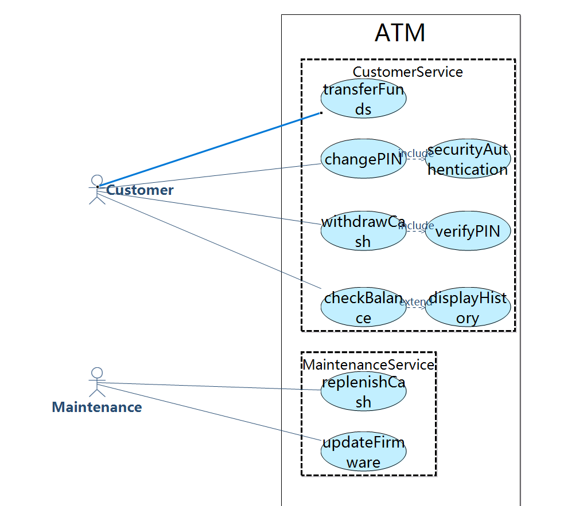
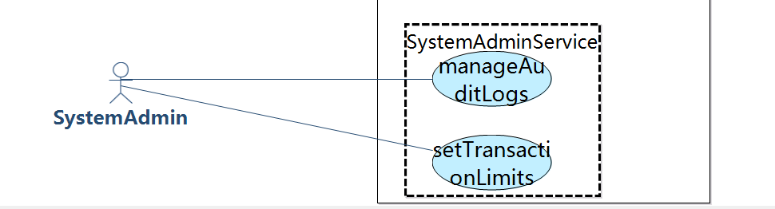
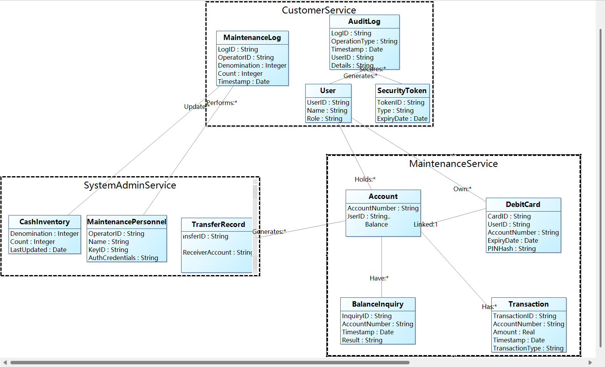
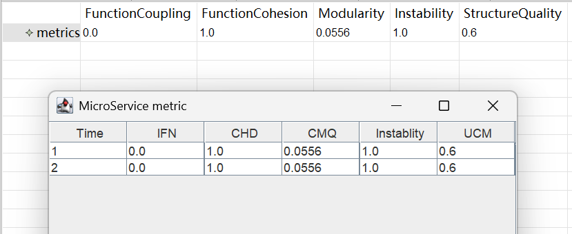
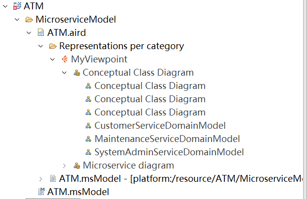
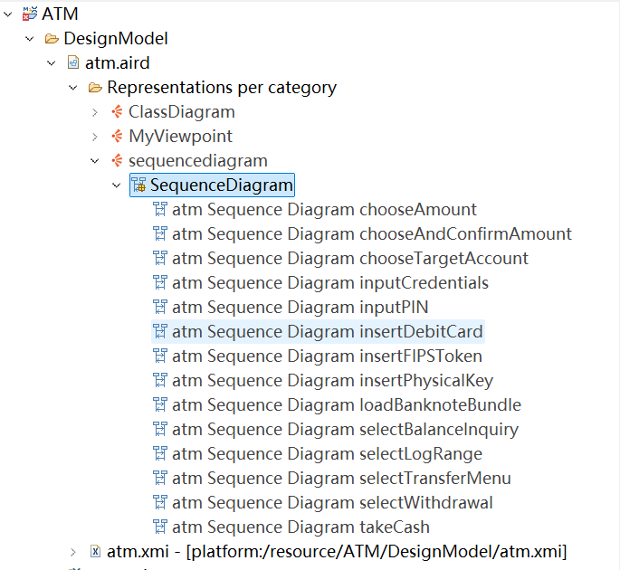
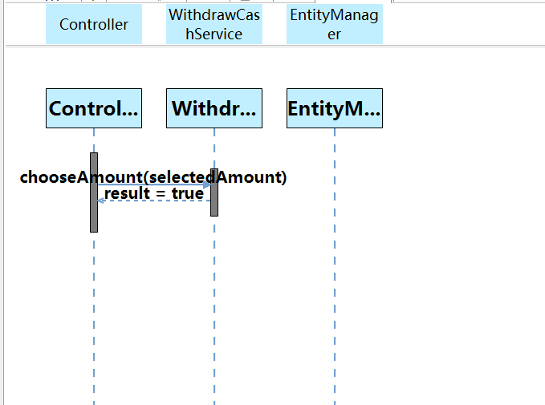
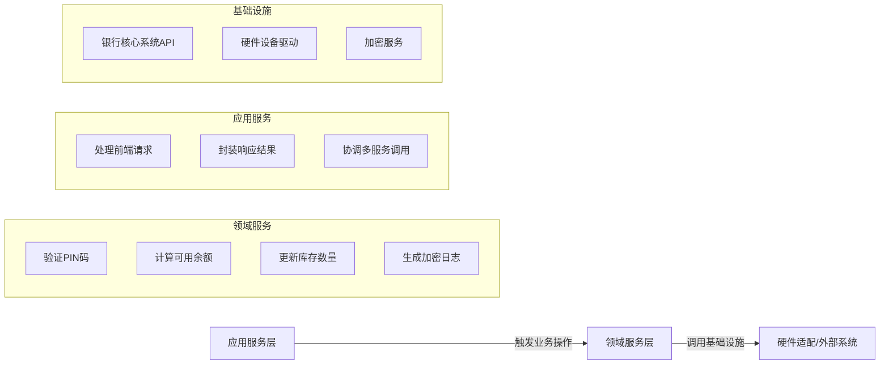
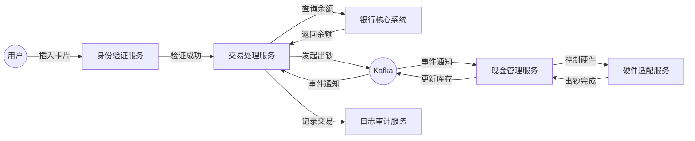

# 实验一：软件需求分析与确认

## 实验目标
1. 掌握需求分析与建模的基本方法，熟练掌握用户需求、系统需求描述的书写  
2. 基于UML建模方法（用例图、系统顺序图、概念类图），使用RM2PT工具进行需求建模与原型生成

---

## 实验内容
1. **实验准备**：选定ATM系统，安装RM2PT工具及自然语言插件  
2. **任务一**：结构化自然语言需求建模  
3. **任务二**：UML需求模型构建  
4. **任务三**：需求原型化与确认  

---

## 建模结果及说明

### 1.模型规模说明

| 模型要素                | 数量 |
| ----------------------- | ---- |
| 用户需求                | 10条 |
| 系统需求（功能/非功能） | 18条 |
| 用例图中Actor           | 3个  |
| 用例数量                | 11个 |
| 系统顺序图              | 6个  |
| 系统操作总数            | 15个 |
| 系统合约数量            | 15个 |
| 概念类数量              | 11个 |

该ATM系统需求共有10条自然语言需求，具体如下：

#### （1）详细描述的需求为6条：

**1.Customer**：I want to withdraw cash

**2.Customer**：I want to check balance

**3.Maintenance Personnel**：I want to replenish cash

**4.System Administrator**：I want to manage audit logs

**5.System Administrator**：I want to set limits

**6.System Administrator**：I want to configure network

#### （2）仅列出需求，未展开流程的为4条：

**7.Customer**：I want to change PIN

**8.Customer**：I want to transfer funds

**9.Maintenance Personnel**：I want to diagnose hardware

**Maintenance Personnel**：I want to update firmware

### 2. 用例图（插入截图位置）


#### A1-customer

| Actor Name:                  | **Customer**                                |
| ---------------------------- | ------------------------------------------- |
| **Actor ID:**                | A1                                          |
| **Description:**             | The customer is the holder of the bank card |
| **Required Functions**       | **Related Use Case**                        |
| The customer withdraws cash  | withdrawCash                                |
| The customer checks balance  | checkBalance                                |
| The customer changes PIN     | changePIN                                   |
| The customer transfers funds | transferFunds                               |

#### A2-Maintenance

| Actor Name:                                | Maintenance                                                  |
| ------------------------------------------ | ------------------------------------------------------------ |
| **Actor ID:**                              | A2                                                           |
| **Description:**                           | The maintenance personnel is responsible for ensuring ATM hardware and software are operational. |
| **Required Functions**                     | **Related Use Case**                                         |
| The maintenance personnel replenishes cash | replenishCash                                                |
| The maintenance personnel updates firmware | updateFirmware                                               |

#### A3-System Administrator

| Actor Name:                               | System Administrator                                         |
| ----------------------------------------- | ------------------------------------------------------------ |
| **Actor ID:**                             | A3                                                           |
| **Description:**                          | The system administrator configures and monitors system-level operations to ensure security and compliance. |
| **Required Functions**                    | **Related Use Case**                                         |
| The administrator manages audit logs      | manageAuditLogs                                              |
| The administrator sets transaction limits | setTransactionLimits                                         |

---

### 3. 系统顺序图


| UseCase Name:      | withdrawCash                                                 |
| ------------------ | ------------------------------------------------------------ |
| UseCase ID:        | UC1                                                          |
| Brief Description: | The customer withdraws cash                                  |
| Involved Actor:    | Customer                                                     |
| Basic Path:        | 1. Customer inserts debit card (insertDebitCard)<br/>2. Customer inputs PIN code (inputPIN)<br/>3. Customer selects withdrawal option (selectWithdrawal)<br/>4. Customer chooses amount (chooseAmount)<br/>5. ATM dispenses cash (takeCash) |


| UseCase Name:      | CheckBalance                                                 |
| ------------------ | ------------------------------------------------------------ |
| UseCase ID:        | UC2                                                          |
| Brief Description: | The customer checks their account balance via ATM            |
| Involved Actor:    | Customer                                                     |
| Basic Path:        | 1.Customer selects balance inquiry option(selectBalanceInquiry) |


| UseCase Name:      | Maintenance                                                  |
| ------------------ | ------------------------------------------------------------ |
| UseCase ID:        | UC3                                                          |
| Brief Description: | Bank staff performs cash replenishment and maintenance operations on the ATM |
| Involved Actor:    | Maintenance Technician                                       |
| Basic Path:        | 1.Technician inserts physical key (insertPhysicalKey)<br/>2.Technician inputs operator credentials (inputCredentials)<br/>3.Technician loads banknote bundles(loadBanknoteBundle) |


| UseCase Name:      | ManageAudit                                                  |
| ------------------ | ------------------------------------------------------------ |
| UseCase ID:        | UC4                                                          |
| Brief Description: | System administrator retrieves and manages ATM transaction logs |
| Involved Actor:    | System Administrator                                         |
| Basic Path:        | 1.Admin inserts FIPS-compliant security token(insertFIPSToken)<br/>2.Admin specifies date range(selectLogRange) |

---

### 4. 概念类图

**说明**：  

- **核心类**：`User`（用户）、`DebitCard`（借记卡）、`Account`（账户）、`Transaction`（交易）等  
- **关联关系**：  
  - `User`拥有`DebitCard`和`Account`  
  - `Account`关联`Transaction`和`BalanceInquiry`  
- **类总数**：11个

---

### 5.需求原型化结果


# 实验二
## 任务一

生成划分模型





类图



metric视图



生成最后的微服务模型，目录结构如下：



## 任务二

生成的类图如下：


生成的序列图如下：




## 任务三

### 一、领域驱动设计（DDD）模型

#### 1. 限界上下文划分
| 限界上下文         | 核心职责                                                                 | 包含功能模块                                                                 |
|--------------------|--------------------------------------------------------------------------|------------------------------------------------------------------------------|
| **身份验证**       | 处理用户身份认证与权限管理                                               | 卡片识别、PIN验证、维护人员双因素认证、管理员USB令牌验证                     |
| **交易处理**       | 管理客户金融交易逻辑                                                     | 现金提取、余额查询、PIN修改、资金转账                                         |
| **现金管理**       | 控制ATM现金库存与硬件交互                                                 | 现金补充、库存校验、出钞机控制、低库存报警                                    |
| **设备维护**       | 管理ATM硬件设备状态与维护操作                                             | 硬件诊断、固件更新、设备状态监控、故障报警                                    |
| **系统管理**       | 配置系统级参数与策略                                                     | 网络配置、交易限额设置、系统参数管理                                         |
| **日志审计**       | 管理审计日志与安全合规记录                                               | 交易日志生成、维护操作记录、日志加密归档、存储容量管理                         |

#### 2. 聚合根、实体与值对象定义
| 限界上下文         | 聚合根               | 实体                          | 值对象                          |
|--------------------|----------------------|-------------------------------|---------------------------------|
| **身份验证**       | 用户会话（UserSession） | 认证日志（AuthLog）           | PIN码（加密值）、证书（Certificate） |
| **交易处理**       | 交易记录（Transaction）  | 账户（Account）                | 金额（Amount）、时间戳（Timestamp）    |
| **现金管理**       | 现金库存（CashInventory） | 钞箱（CashCassette）           | 货币类型（CurrencyType）、面额（Denomination） |
| **设备维护**       | 设备状态（DeviceStatus）  | 硬件组件（HardwareComponent）  | 故障代码（ErrorCode）、固件版本（FirmwareVersion） |
| **系统管理**       | 系统配置（SystemConfig）  | 限额策略（LimitPolicy）        | 网络参数（NetworkParams）、阈值（Threshold）   |
| **日志审计**       | 审计日志（AuditLog）    | 日志条目（LogEntry）           | 加密哈希（HashValue）、存储位置（StoragePath） |

#### 3. 领域服务与应用服务边界


- **领域服务**：负责核心业务逻辑（如 PIN 验证、余额计算、库存更新），不依赖外部接口。
- **应用服务**：处理请求路由、事务协调（如现金提取流程中调用身份验证→交易处理→现金管理），调用基础设施层。
- **外部集成点**：银行核心系统（实时余额查询）、硬件设备驱动（出钞机控制）、加密服务（AES 日志加密）。

### 二、微服务架构设计

#### 1. 微服务列表
| 服务名称          | 限界上下文      | 核心职责                                                                 | 接口类型   | 数据存储                | 技术栈                 |
|-------------------|-----------------|--------------------------------------------------------------------------|------------|-------------------------|------------------------|
| **身份验证服务**  | 身份验证        | 处理卡片识别、PIN加密验证、双因素认证逻辑                               | gRPC       | PostgreSQL（用户凭证表）| Java Spring Boot       |
| **交易处理服务**  | 交易处理        | 管理现金提取、转账、余额查询的业务逻辑与事务协调                         | REST       | MongoDB（交易记录）     | Node.js Express        |
| **现金管理服务**  | 现金管理        | 监控库存状态、控制出钞机硬件、生成补货报告、触发低库存警报               | 消息队列（Kafka） | PostgreSQL（库存表）    | Go + gRPC              |
| **设备维护服务**  | 设备维护        | 处理硬件诊断请求、固件更新推送、故障状态采集与报警通知                   | MQTT       | InfluxDB（设备状态时序数据） | Python + Django       |
| **系统配置服务**  | 系统管理        | 管理网络配置、交易限额策略、系统参数的增删改查                           | REST       | MySQL（配置表）         | Spring Cloud Alibaba   |
| **日志审计服务**  | 日志审计        | 生成加密审计日志、管理日志归档与存储容量，提供合规性查询接口             | gRPC       | Elasticsearch（日志索引）| C#/.NET Core           |
| **硬件适配服务**  | 设备维护        | 抽象硬件接口（读卡器、出钞机），提供统一驱动协议转换                     | 本地API    | 无状态服务              | Rust + WebAssembly     |

#### 2. 服务间协作流程（现金提取场景）
```plaintext
1. 用户插入卡片 → 身份验证服务（gRPC调用）验证PIN码  
2. 验证通过 → 交易处理服务（REST）发起余额查询请求  
3. 交易处理服务 → 调用银行核心系统API获取实时余额  
4. 余额充足 → 交易处理服务发布“开始出钞”事件（Kafka）  
5. 现金管理服务监听事件 → 控制硬件适配服务驱动出钞机  
6. 出钞完成 → 现金管理服务更新库存并发布“交易完成”事件  
7. 交易处理服务监听事件 → 生成交易记录并调用日志审计服务写入日志  
```

#### 3. 非功能需求实现方案

| 维度         | 方案描述                                                     |
| ------------ | ------------------------------------------------------------ |
| **安全性**   | - 端到端 TLS 加密（API 调用）+ AES-256 字段加密（PIN、日志） - 维护人员双因素认证（物理钥匙 + 密码） - JWT 令牌用于服务间鉴权 |
| **性能优化** | - Redis 缓存常用账户余额（TTL=5s） - Hystrix 熔断机制保护银行核心系统 API - 异步日志写入（Kafka 削峰填谷） |
| **可观测性** | - ELK Stack 采集全链路日志 - Prometheus 监控指标（如交易成功率、库存阈值） - Grafana 可视化面板（实时交易趋势、设备状态） |
| **硬件容错** | - 硬件适配服务提供重试机制（最多 3 次，间隔 100ms） - 出钞机故障时，现金管理服务切换至 “只读模式” 并触发报警 |

#### 4. 硬件集成设计

- **设备抽象层**：通过`硬件适配服务`定义统一接口`DeviceAdapter`，屏蔽不同厂商硬件差异（如 NCR、Diebold 设备驱动）。
- **状态监控**：设备维护服务定期轮询硬件状态（如钞箱容量、读卡器信号），通过 MQTT 协议推送至物联网网关。
- **固件更新**：采用灰度发布策略，先对单台 ATM 进行固件升级，验证通过后批量推送，支持回滚机制。

#### 5. 关键模块交互图
