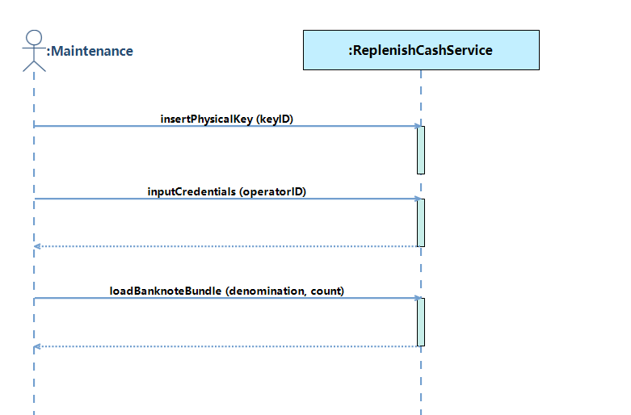

# 实验一：软件需求分析与确认

## 实验目标
1. 掌握需求分析与建模的基本方法，熟练掌握用户需求、系统需求描述的书写  
2. 基于UML建模方法（用例图、系统顺序图、概念类图），使用RM2PT工具进行需求建模与原型生成

---

## 实验内容
1. **实验准备**：选定ATM系统，安装RM2PT工具及自然语言插件  
2. **任务一**：结构化自然语言需求建模  
3. **任务二**：UML需求模型构建  
4. **任务三**：需求原型化与确认  

---

## 建模结果及说明

### 1. 用例图（插入截图位置）

**说明**：  

- **Actor**：`Customer`（客户）、`Maintenance`（维护人员）、`SystemAdmin`（系统管理员）  
- **核心用例**：  
  - `withdrawCash`（取现）包含`verifyPIN`（验证PIN码）  
  - `checkBalance`（查询余额）扩展`displayHistory`（显示历史记录）  
  - `transferFunds`（转账）、`replenishCash`（补充现金）等  
- **关系**：`include`（取现需验证PIN）、`extend`（查询余额扩展历史记录）  

---

### 2. 系统顺序图

---

### 3. 概念类图
**说明**：  
- **核心类**：`User`（用户）、`DebitCard`（借记卡）、`Account`（账户）、`Transaction`（交易）等  
- **关联关系**：  
  - `User`拥有`DebitCard`和`Account`  
  - `Account`关联`Transaction`和`BalanceInquiry`  
- **类总数**：11个（满足≥8要求）  

---

## 模型规模说明
| 模型要素                | 数量 | 要求  |
| ----------------------- | ---- | ----- |
| 用户需求                | 10条 | ≥8条  |
| 系统需求（功能/非功能） | 18条 | ≥15条 |
| 用例图中Actor           | 3个  | ≥2个  |
| 用例数量                | 11个 | ≥4个  |
| 系统顺序图              | 6个  | ≥4个  |
| 系统操作总数            | 15个 | ≥12个 |
| 系统合约数量            | 15个 | ≥12个 |
| 概念类数量              | 11个 | ≥8个  |

---

## 需求原型化结果

