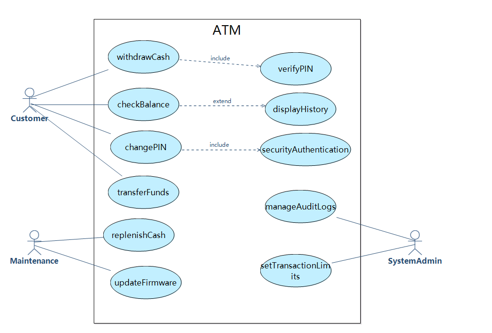

# 实验一：软件需求分析与确认

## 实验目标
1. 掌握需求分析与建模的基本方法，熟练掌握用户需求、系统需求描述的书写  
2. 基于UML建模方法（用例图、系统顺序图、概念类图），使用RM2PT工具进行需求建模与原型生成

---

## 实验内容
1. **实验准备**：选定ATM系统，安装RM2PT工具及自然语言插件  
2. **任务一**：结构化自然语言需求建模  
3. **任务二**：UML需求模型构建  
4. **任务三**：需求原型化与确认  

---

## 建模结果及说明

### 1.模型规模说明

| 模型要素                | 数量 |
| ----------------------- | ---- |
| 用户需求                | 10条 |
| 系统需求（功能/非功能） | 18条 |
| 用例图中Actor           | 3个  |
| 用例数量                | 11个 |
| 系统顺序图              | 6个  |
| 系统操作总数            | 15个 |
| 系统合约数量            | 15个 |
| 概念类数量              | 11个 |

该ATM系统需求共有10条自然语言需求，具体如下：

#### （1）详细描述的需求为6条：

**1.Customer**：I want to withdraw cash

**2.Customer**：I want to check balance

**3.Maintenance Personnel**：I want to replenish cash

**4.System Administrator**：I want to manage audit logs

**5.System Administrator**：I want to set limits

**6.System Administrator**：I want to configure network

#### （2）仅列出需求，未展开流程的为4条：

**7.Customer**：I want to change PIN

**8.Customer**：I want to transfer funds

**9.Maintenance Personnel**：I want to diagnose hardware

**Maintenance Personnel**：I want to update firmware

### 2. 用例图（插入截图位置）

#### A1-customer

| Actor Name:                  | **Customer**                                |
| ---------------------------- | ------------------------------------------- |
| **Actor ID:**                | A1                                          |
| **Description:**             | The customer is the holder of the bank card |
| **Required Functions**       | **Related Use Case**                        |
| The customer withdraws cash  | withdrawCash                                |
| The customer checks balance  | checkBalance                                |
| The customer changes PIN     | changePIN                                   |
| The customer transfers funds | transferFunds                               |

#### A2-Maintenance

| Actor Name:                                | Maintenance                                                  |
| ------------------------------------------ | ------------------------------------------------------------ |
| **Actor ID:**                              | A2                                                           |
| **Description:**                           | The maintenance personnel is responsible for ensuring ATM hardware and software are operational. |
| **Required Functions**                     | **Related Use Case**                                         |
| The maintenance personnel replenishes cash | replenishCash                                                |
| The maintenance personnel updates firmware | updateFirmware                                               |

#### A3-System Administrator

| Actor Name:                               | System Administrator                                         |
| ----------------------------------------- | ------------------------------------------------------------ |
| **Actor ID:**                             | A3                                                           |
| **Description:**                          | The system administrator configures and monitors system-level operations to ensure security and compliance. |
| **Required Functions**                    | **Related Use Case**                                         |
| The administrator manages audit logs      | manageAuditLogs                                              |
| The administrator sets transaction limits | setTransactionLimits                                         |

---

### 3. 系统顺序图

| UseCase Name:      | withdrawCash                                                 |
| ------------------ | ------------------------------------------------------------ |
| UseCase ID:        | UC1                                                          |
| Brief Description: | The customer withdraws cash                                  |
| Involved Actor:    | Customer                                                     |
| Basic Path:        | 1. Customer inserts debit card (insertDebitCard) 2. Customer inputs PIN code (inputPIN) 3. Customer selects withdrawal option (selectWithdrawal) 4. Customer chooses amount (chooseAmount) 5. ATM dispenses cash (takeCash) |

| UseCase Name:      | CheckBalance                                                 |
| ------------------ | ------------------------------------------------------------ |
| UseCase ID:        | UC2                                                          |
| Brief Description: | The customer checks their account balance via ATM            |
| Involved Actor:    | Customer                                                     |
| Basic Path:        | 1.Customer selects balance inquiry option(selectBalanceInquiry) |

| UseCase Name:      | Maintenance                                                  |
| ------------------ | ------------------------------------------------------------ |
| UseCase ID:        | UC3                                                          |
| Brief Description: | Bank staff performs cash replenishment and maintenance operations on the ATM |
| Involved Actor:    | Maintenance Technician                                       |
| Basic Path:        | 1.Technician inserts physical key (insertPhysicalKey) 2.Technician inputs operator credentials (inputCredentials) 3.Technician loads banknote bundles(loadBanknoteBundle) |

| UseCase Name:      | ManageAudit                                                  |
| ------------------ | ------------------------------------------------------------ |
| UseCase ID:        | UC4                                                          |
| Brief Description: | System administrator retrieves and manages ATM transaction logs |
| Involved Actor:    | System Administrator                                         |
| Basic Path:        | 1.Admin inserts FIPS-compliant security token(insertFIPSToken) 2.Admin specifies date range(selectLogRange) |

---

### 4. 概念类图
**说明**：  
- **核心类**：`User`（用户）、`DebitCard`（借记卡）、`Account`（账户）、`Transaction`（交易）等  
- **关联关系**：  
  - `User`拥有`DebitCard`和`Account`  
  - `Account`关联`Transaction`和`BalanceInquiry`  
- **类总数**：11个

---

### 5.需求原型化结果

